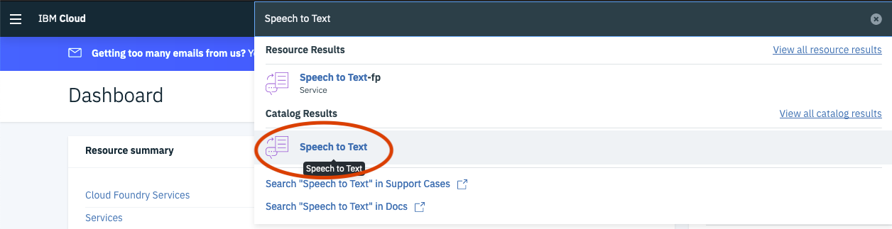
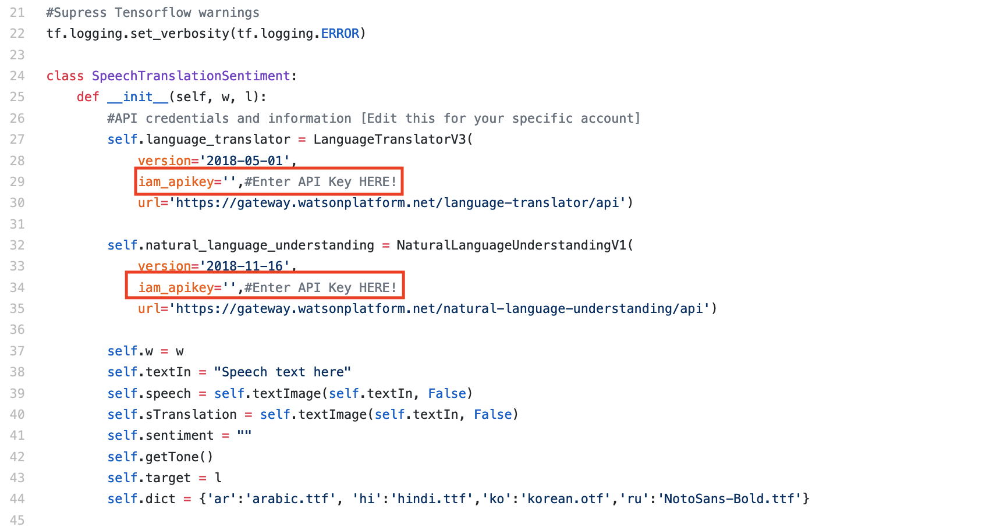

# BashScriptCall
&nbsp;&nbsp;&nbsp;&nbsp;A script used in Ubuntu to execute python scripts from different directories in new terminal windows. This script requires a bit of set up, below are instructions for setting up your workspace to accomodate for the these changes. Feel free to contribute to this code, the read me, or the project to make it better for others to use.

## Script to Run Python in New Windows (Ubuntu)
Open the terminal window and change directories to the directory containing the ScriptRunner.sh file.

&nbsp;&nbsp;&nbsp;&nbsp;&nbsp;&nbsp;

### GIVE THE SCRIPT EXECUTION PERMISSIONS
Change execution permissions on file if necessary with:

`chmod u+x ScriptRunner.sh`.

&nbsp;&nbsp;&nbsp;&nbsp;&nbsp;&nbsp;

### EDIT YOUR BASH FILE
Go in to your bashrc file to allow windows to retain names when changed

`vim ~/.bashrc`

&nbsp;&nbsp;&nbsp;&nbsp;&nbsp;&nbsp;

&nbsp;&nbsp;&nbsp;&nbsp;&nbsp;&nbsp;

Press i and scroll down till you find a line that looks like this:

`PS1="\[\e]0;${debian_chroot:+($debian_chroot)}\u@\h: \w\a\]$PS1"`

&nbsp;&nbsp;&nbsp;&nbsp;&nbsp;&nbsp;

Change:

`PS1="\[\e]0;${debian_chroot:+($debian_chroot)}\u@\h: \w\a\]$PS1"`

&nbsp;&nbsp;&nbsp;&nbsp;&nbsp;&nbsp;&nbsp;&nbsp;&nbsp;&nbsp;&nbsp;&nbsp;&nbsp;&nbsp;&nbsp;&nbsp;&nbsp;&nbsp;&nbsp;&nbsp;&nbsp;&nbsp;&nbsp;&nbsp;&nbsp;&nbsp;&nbsp;&nbsp;&nbsp;&nbsp;&nbsp;&nbsp;&nbsp;&nbsp;&nbsp;&nbsp;&nbsp;&nbsp;&nbsp;&nbsp;&nbsp;&nbsp;&nbsp;&nbsp;&nbsp;&nbsp;&nbsp;&nbsp;&nbsp;&nbsp;&nbsp;to:

`PS1="${debian_chroot:+($debian_chroot)}\u@\h \w$"`

&nbsp;&nbsp;&nbsp;&nbsp;&nbsp;&nbsp;

Press the escape key.
Enter a : with the keyboard.
Type `wq!`

&nbsp;&nbsp;&nbsp;&nbsp;&nbsp;&nbsp;

Now execute: `source ~/.bashrc`

&nbsp;&nbsp;&nbsp;&nbsp;&nbsp;&nbsp;

[Setting Gnome-Terminal Titles Froum](https://askubuntu.com/questions/30988/how-do-you-set-the-title-of-the-active-gnome- terminal-from-the-command-line)

### **IN CASE YOU MESS UP**
[Forum on restoring bashrc to default](https://askubuntu.com/questions/404424/how-do-i-restore-bashrc-to-its-default)

The below lines will reset your bash file:

- `/>/bin/cp ~/.bashrc ~/my_bashrc`
- `/bin/cp /etc/skel/.bashrc`
- `~/ source ~/.bashrc`

&nbsp;&nbsp;&nbsp;&nbsp;&nbsp;&nbsp;.

### CHOOSING THE SCRIPTS TO RUN
To choose what scripts to run you need to go into the ScriptRunner.sh file and change the scripts array entries.

Simply add in the absolute file path of your script with the script in it, for example:

`scripts=(“/Home/gurus/Documents/test.py” “...”)`

Then in the names array you can give the terminal a unique name:

`names=(“Documents_Test” “...”)`
Names can not contain spaces.

Finally run the code by entering:
`./ScriptRunner.sh`

&nbsp;&nbsp;&nbsp;&nbsp;&nbsp;&nbsp;.

Then enter and run that in the command line.

&nbsp;&nbsp;&nbsp;&nbsp;&nbsp;&nbsp;.

### &nbsp;&nbsp;&nbsp;&nbsp;&nbsp;&nbsp;&nbsp;&nbsp;&nbsp;&nbsp;&nbsp;&nbsp;&nbsp;&nbsp;&nbsp;&nbsp;&nbsp;&nbsp;&nbsp;&nbsp;&nbsp;&nbsp;Please contribute or comment if necessary.
